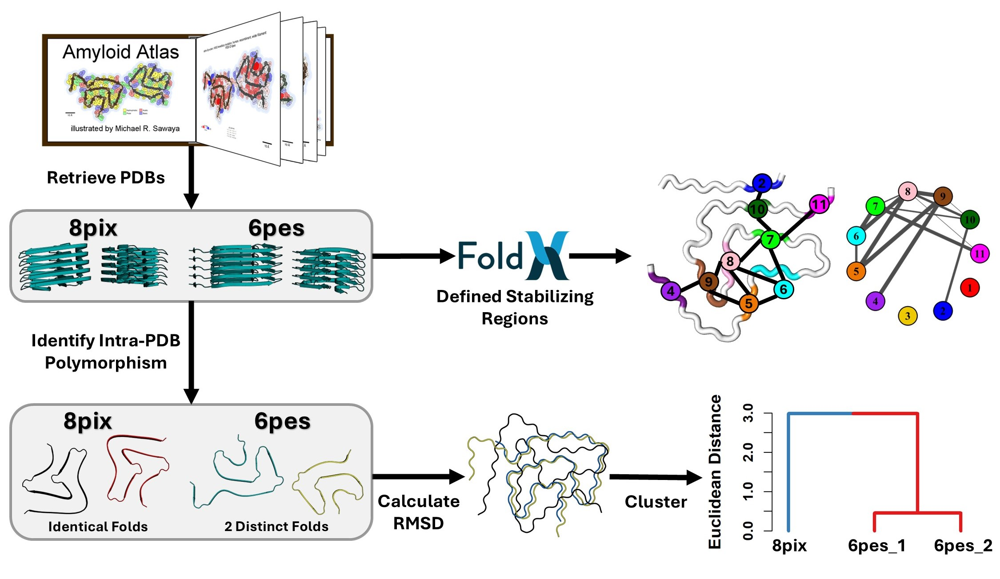

# Structural Analysis and Hierarchical Clustering of Solved Amyloid Structures

### Author: Jack P Connor
### Contact: bsjpc@leeds.ac.uk

### Last Updated 07-07-2025

## ABSTRACT

More than 500 amyloid structures have been solved to date to near-atomic resolution. This has highlighted an enormous diversity of fibril structures conforming to the canonical cross-β amyloid fold. Using α-synuclein and tau amyloid structures as models, we show that they can be clustered into topologically distinct fold families. In these classes, the same, or similar, regions pair in different ways to generate topologies that can be hierarchically clustered. Despite their different topologies, the fibrils have similar stability, as determined by FoldX. The results provide a framework to classify newly solved fibril structures as belonging to an existing class or forming a new topological cross-β fold. Furthermore, this enables comparisons between fibrils found in disease and those formed in vitro. The workflow has been automated, enabling users to interrogate new amyloid structures as they emerge using this pipeline.

## Features
* Web scrape the [Amyloid Atlas](https://people.mbi.ucla.edu/sawaya/amyloidatlas/) to access known published structures
* Identify unique chains from each PDB file (intra-PDB variation)
* Calculate structural similarity between each unique chain using RMSD
* Hierarchical clustering of amyloid structures into defined groups based on their structural properties
* Compare stabilities for each amyloid structure using FoldX
* Define stabilising regions
* Analyse how the stabilising regions interact for each structural group identified by RMSD clustering
* Calculate the propensity for each residue in the ordered fibril core to be in a B-sheet

  

## INSTALLATION
Ensure FoldX is installed on your system and added to your path. Follow the instuctions given by PyFoldx: https://github.com/leandroradusky/pyfoldx

## Running the analysis

The analysis pipeline is run in a Linux terminal using the script run_analysis.sh. In this script, you can change the run parameters to select which scripts you would like to run.

